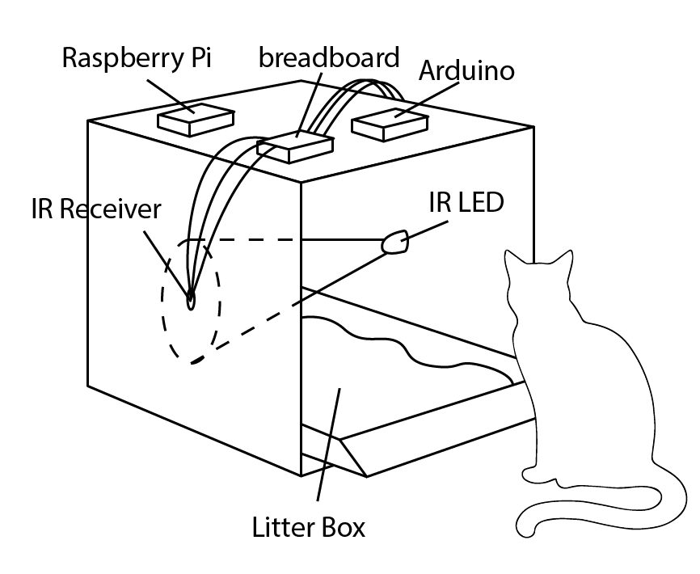
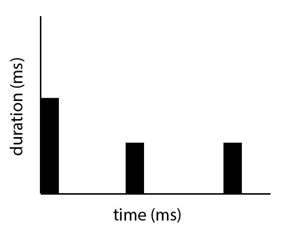

# Catveilance

Collection of litter box usage by my roommate's newly adopted Maine Coon cat over the course of a weekend.

# Surveillance Method
components:
1. Arduino
2. [IR LED](https://www.adafruit.com/products/387)
3. [IR Receiver](https://www.adafruit.com/products/157?gclid=Cj0KEQjwhbzABRDHw_i4q6fXoLIBEiQANZKGW7dJlTxkTXFNXupkK4itN6H6y73-R0edhgBYN3EJGyMaArh68P8HAQ)
4. Raspberry Pi

# Diagram

# Example data output
`activity start:
160748
Duration:
102
activity start:
257138
Duration:
102
activity start:
267446
Duration:
101
activity start:
463862
Duration:
102
activity start:
1039663
Duration:
101`

# Example data viz

# Notes on IR sensor
Sunlight appeared to trigger a response from the IR sensor, even though the IR sensor claims to filter out noise. Either that or the IR light doesn't emit a wide enough beam. Most of the data is therefore **erroneous**, unfortunately.
