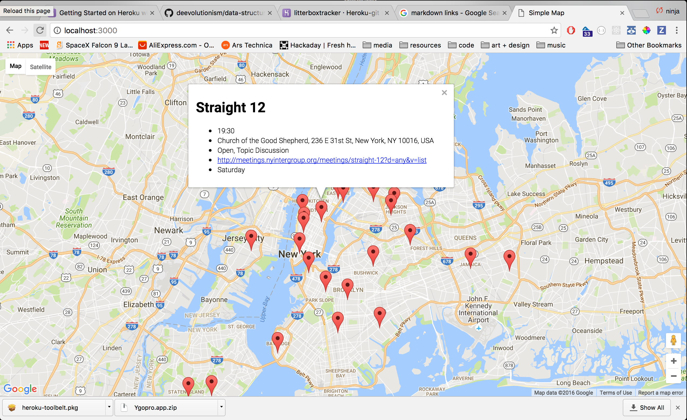

# Final Assignment 1
### Interface re-design for Alcohol Anonymous New York.

process included scraping the data from the original AA site. Data such as the group name, building and address, notes about the specific meeting, as well as all of the scheduled meeting times.

The data was then compiled into json format and pushed into a mongo database stored on my local machine.

Example json
```
{ "_id" : ObjectId("57f5d1c7fabc11302d4df451"), "location" : "Alanon House", "address" : "303 West 42nd Street", "type" : "Step Meeting", "name" : "A New Freedom", "link" : "http://meetings.nyintergroup.org/meetings/a-new-freedom?d=any&v=list", "time" : "08:00", "region" : "Hell's Kitchen", "lat" : 40.7576553, "long" : -73.9899274, "formatted_address" : "303 W 42nd St, New York, NY 10036, USA", "day" : "0" }
{ "_id" : ObjectId("57f5d1c7fabc11302d4df452"), "location" : "Asbury Methodist Church", "address" : "167 Scarsdale Road", "type" : "Closed", "name" : "Bronxville Asbury", "link" : "http://meetings.nyintergroup.org/meetings/bronxville-asbury?d=any&v=list", "time" : "08:00", "region" : "Tuckahoe", "lat" : 40.9570747, "long" : -73.8312565, "formatted_address" : "167 Scarsdale Rd, Tuckahoe, NY 10707, USA", "day" : "0" }
{ "_id" : ObjectId("57f5d1c7fabc11302d4df453"), "location" : "Greenpoint Reformed Church", "address" : "136 Milton Street", "type" : "Big Book", "name" : "Sober Sunday", "link" : "http://meetings.nyintergroup.org/meetings/sober-sunday?d=any&v=list", "time" : "08:00", "region" : "Greenpoint", "lat" : 40.7291861, "long" : -73.9549699, "formatted_address" : "136 Milton St, Brooklyn, NY 11222, USA", "day" : "0" }
{ "_id" : ObjectId("57f5d1c7fabc11302d4df454"), "location" : "Immanuel Lutheran Church", "address" : "1296 Lexington Avenue", "type" : "Open, Topic Discussion", "name" : "Chapter Five", "link" : "http://meetings.nyintergroup.org/meetings/chapter-five?d=any&v=list", "time" : "08:00", "region" : "Yorkville / Carnegie Hill", "lat" : 40.780699, "long" : -73.954995, "formatted_address" : "1296 Lexington Ave, New York, NY 10128, USA", "day" : "0" }
```
The website is deployed locally. The meeting data is represented on the front end by google maps. The map displays markers which indicate current and upcoming AA meetings for the day.


