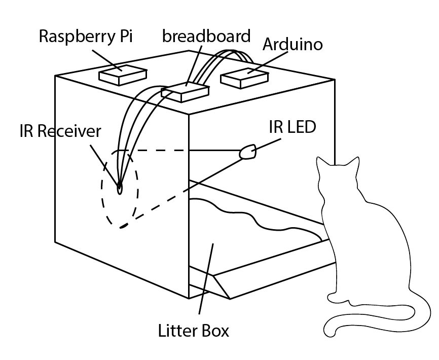
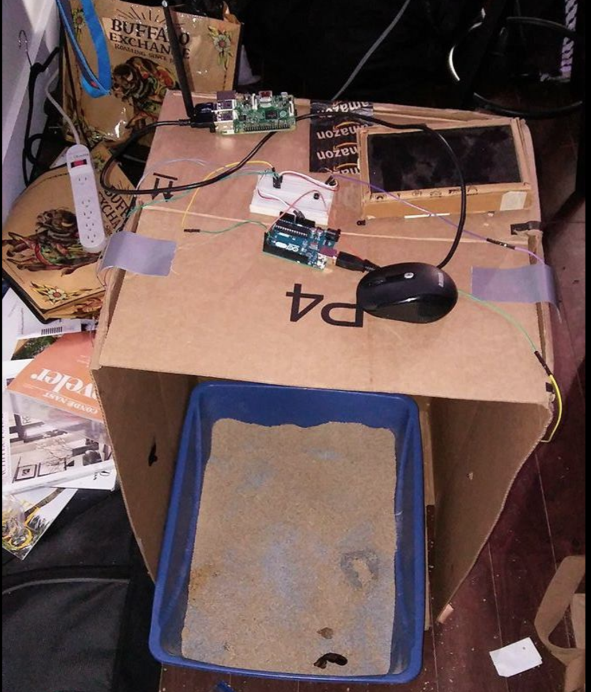
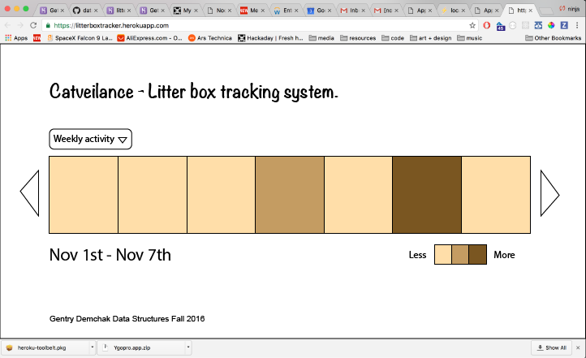
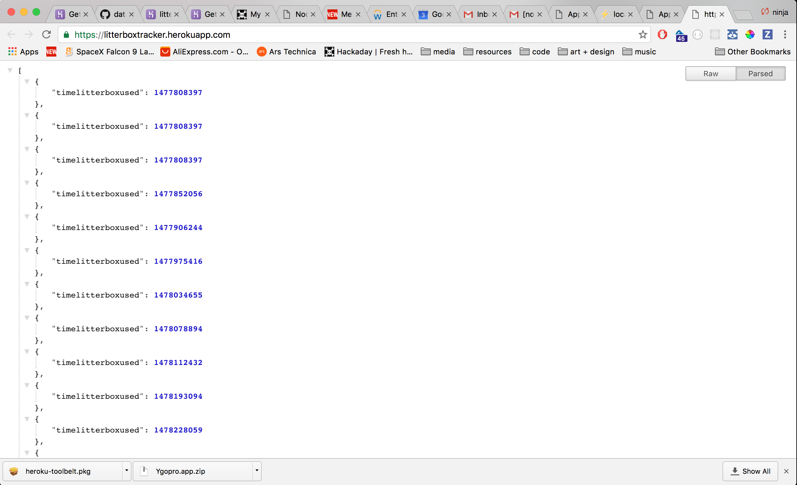

# Final Assignment 2
### Collecting, storing, and sharing sensor data.

For this final assignment, I collected data on my cat's litter box usage throughout the week.

I didn't want to invade my cats privacy nor did I want to have to be next to the litterbox 24/7 so I decided to hook up the arduino and its ir/ir reciever peripherals to a raspberry pi. The data was saved to a text file which was later input to AWS mySQL relational database.

#### Parts diagram

#### Setup

#### Interface mockup

#### Heroku deployment

